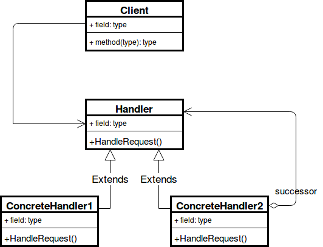

# 책임 연쇄 패턴(`Chain of Responsibility Pattern`, `COR`)

## 책임 연쇄 패턴이란?

명령 객체와 일련의 처리 객체를 포함하는 디자인 패턴.

각각의 처리 객체는 명령 객체를 처리할 수 있는 연산의 집합.  
체인 안의 처리 객체가 핸들할 수 없는 명령은 다음 처리 객체로 넘겨짐.

이 작동 방식은 새로운 처리 객체부터 체인의 끝까지 다시 반복.

> 어떤 요청이 그 요청을 담당하는 객체에 들어오면 각각의 요청에 대해서 특정한 객체가 담당하는 것이 일반적이지만 객체를 연결리스트와 같은 사슬 방식으로 연결한 후에 요청을 수행하지 못하는 객체라면 다음 객체에 넘기며 책임을 넘기는 형태의 패턴.

> 클래스 안에 연결 리스트 알고리즘을 걸고, 특정 함수를 실행하면 연속적으로 실행하는 패턴.

---

## UML



- ### `Handler`

  - 요청을 수신하고 처리객체들의 집합에 전달하는 인터페이스
  - 집합의 첫 번째 핸들러에 대한 정보만 가지고 있으며 그 이후의 핸들러에 대해서는 모름

- ### `Concrete handlers`

  - 요청을 처리하는 실제 처리 객체

- ### `Client`

  - 요청을 전달하는 클라이언트

- 표준 책임 연쇄 모델이 변화하면서, 어떤 처리 방식에서는 다양한 방향으로 명령을 보내 책임을 트리 형태로 바꾸는 관제사 역할을 하기도 함.
- 몇몇 경우에서는 처리 객체가 상위의 처리 객체와 명령을 호출하여 작은 파트의 문제를 해결하기 위해 재귀적으로 실행.
  이 경우 재귀는 명령이 처리되거나 모든 트리가 탐색될 때까지 진행.

---

## 책임 연쇄 패턴의 장단점

### 장점

- 결합도를 낮추며, 요청의 발신자와 수신자를 분리.
- 클라이언트는 처리 객체의 집합 내부의 구조를 알 필요가 없음.
- 집합 내의 처리 순서를 변경하거나 처리 객체를 추가 또는 삭제할 수 있어 유연성이 향상.
- 새로운 요청에 대한 처리 객체 생성이 매우 편리.

### 단점

- 충분한 디버깅을 거치지 않았을 경우 집합 내부에서 사이클이 발생.
- 디버깅 및 테스트가 어려움.
- 요청을 처리할 객체가 `chain` 내부에서 어느 위치에 있을 지는 동적으로 변경되기 때문에 시간 예측이 어려움.

## 책임 연쇄 패턴 주 사용처

- 요청의 발신자와 수신자를 분리하는 경우
- 요청을 처리할 수 있는 객체가 여러 개일 때 그 중 하나에게 요청을 보내려는 경우
- 코드에서 처리 객체(`handler`)를 명시적으로 지정하고 싶지 않은 경우
- `XML` 인터프리터
- `try { ... } catch { ... }` 문
- 서버에서 `URL` 라우팅
- `GUI`에서 이벤트 버블링

## Example Code

- `Help` 이벤트 버블링 처리 예제

```ts
interface HelpHandler {
  showHelpMessage(): void;
}

class BaseHandler implements HelpHandler {
  protected container: HelpHandler;
  protected help_message: string;

  constructor(protected element_name: string) {}

  public setHelpMessage(help_message: string): void {
    this.help_message = help_message;
  }

  public setContainer(container: HelpHandler): void {
    this.container = container;
  }

  public showHelpMessage(): void {
    if (this.help_message !== null) {
      console.log(this.help_message);
    } else if (this.container) {
      this.container.showHelpMessage();
    }
  }
}

class Button extends BaseHandler {
  constructor(element_name: string) {
    super(element_name);
  }
}

class Container extends BaseHandler {
  protected children: BaseHandler[];

  constructor(element_name: string) {
    super(element_name);
    this.children = [];
  }

  public addChildren(child: BaseHandler): void {
    child.setContainer(this);
    this.children.push(child);
  }
}

class Panel extends Container {
  private panel_help_mesage: string;

  constructor(element_name: string) {
    super(element_name);
  }

  public setPanelHelpMessage(panel_help_mesage: string): void {
    this.panel_help_mesage = panel_help_mesage;
  }

  public showHelpMessage(): void {
    if (this.panel_help_mesage !== null) {
      console.log("panelHelpMessage: ", this.panel_help_mesage);
    } else {
      console.log("pass a request to next reference: ", super.element_name);
      super.showHelpMessage();
    }
  }
}

class Dialog extends Container {
  private dialog_help_mesage: string;

  constructor(element_name: string) {
    super(element_name);
  }

  public setDialogHelpMessage(dialog_help_mesage: string): void {
    this.dialog_help_mesage = dialog_help_mesage;
  }

  public showHelpMessage(): void {
    if (this.dialog_help_mesage !== null) {
      console.log("dialogHelpMessage: ", this.dialog_help_mesage);
    } else {
      console.log("pass a request to next reference: ", super.element_name);
      super.showHelpMessage();
    }
  }
}

const okButton: Button = new Button("OK Button");
const cancelButton: Button = new Button("Cancel Button");

const panel: Panel = new Panel("Parent Panel");
panel.addChildren(okButton);
panel.addChildren(cancelButton);

const confirmDialog: Dialog = new Dialog("Confirm Dialog");
confirmDialog.setHelpMessage(
  "Confirm Dialog Help Message: Please click OK or Cancel Button!"
);

confirmDialog.addChildren(panel);

okButton.showHelpMessage();

okButton.setHelpMessage("OK Button Help Message: Please click OK Button!");
okButton.showHelpMessage();
```

- 거스름돈 자판기 예제

```ts
// 돈 `DTO` 객체
class Currency {
  constructor(private amount: number) {}

  public getAmount(): number {
    return this.amount;
  }
}

interface DispenseChain {
  setNextChain(nextChain: DispenseChain): void;
  dispense(cur: Currency): void;
}

class DigitSingleDispenser implements DispenseChain {
  private chain: DispenseChain | null = null;

  public setNextChain(nextChain: DispenseChain): void {
    this.chain = nextChain;
  }

  public dispense(cur: Currency): void {
    const num: number = cur.getAmount() / 1;
    console.log("Dispensing", num, "1원");
  }
}

class Digit10Dispenser implements DispenseChain {
  private chain: DispenseChain | null = null;

  public setNextChain(nextChain: DispenseChain): void {
    this.chain = nextChain;
  }

  public dispense(cur: Currency): void {
    const get_amount: number = cur.getAmount();
    if (get_amount >= 10) {
      const num: number = get_amount / 10;
      const remain: number = get_amount % 10;

      console.log("Dispensing", num, "10원");
      if (remain !== 0) {
        this.chain.dispense(new Currency(remain));
      }
    } else {
      this.chain.dispense(cur);
    }
  }
}

class Digit100Dispenser implements DispenseChain {
  private chain: DispenseChain | null = null;

  public setNextChain(nextChain: DispenseChain): void {
    this.chain = nextChain;
  }

  public dispense(cur: Currency): void {
    const get_amount: number = cur.getAmount();
    if (get_amount >= 100) {
      const num: number = get_amount / 100;
      const remain: number = get_amount % 10;

      console.log("Dispensing", num, "100원");
      if (remain !== 0) {
        this.chain.dispense(new Currency(remain));
      }
    } else {
      this.chain.dispense(cur);
    }
  }
}

const digit100: Digit100Dispenser = new Digit100Dispenser();
const digit10: Digit10Dispenser = new Digit10Dispenser();
const digitSingle: DigitSingleDispenser = new DigitSingleDispenser();

digit100.setNextChain(digit10);
digit10.setNextChain(digitSingle);

digit100.dispense(new Currency(378));
```

---

## 참고 자료

- [위키 백과](https://ko.wikipedia.org/wiki/%EC%B1%85%EC%9E%84_%EC%97%B0%EC%87%84_%ED%8C%A8%ED%84%B4)
- [Refactoring-guru](https://refactoring.guru/design-patterns/chain-of-responsibility)
- [Theo Blog](https://k0102575.github.io/articles/2020-02/chain-of-responsibility-pattern)
- [언제나 신입 Blog](https://always-intern.tistory.com/1)
- [불곰 Blog](https://brownbears.tistory.com/552)
- [명월일지 Blog](https://nowonbun.tistory.com/456)
- [DogHujup Blog](https://ocwokocw.tistory.com/108)
- [chan.log Blog](https://velog.io/@cham/Design-Pattern-%EC%B1%85%EC%9E%84-%EC%97%B0%EC%87%84-%ED%8C%A8%ED%84%B4chain-of-responsibility-pattern)
