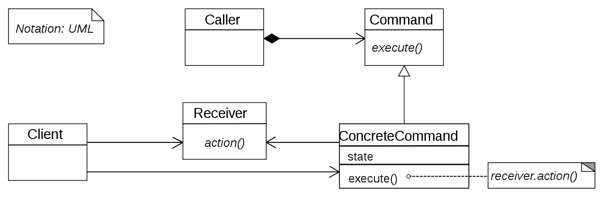

# Command Pattern

## 커맨트 패턴이란?
- 특정 객체에 대한 행동을 객체화 하여 필요에 따라 처리하는 패턴
 
## UML

- 명령(Command): 수신자(Receiver)의 정보 + 행동이 들어 있는 객체
- 수신자(Receiver): 행동을 하는 객체
- 발동자(Caller): 커맨드를 저장함 수신자에게 행동을 전달
- 클라이언트(Client): 커맨드 객체를 생성, 발동자(Caller)를 통해 수신자(Receiver)에게 할 행동을 전달

## Example code

```ts
interface ICar {
  ride(): void;

  turn(): void;

  stop(): void;
}

class Car implements ICar {
  constructor(name: string) {
    this.name = name
  }

  ride(): void {
    console.log(this.name + 'is riding...');
  }

  turn(): void {
    console.log(this.name + 'is turn...');
  }

  stop(): void {
    console.log(this.name + 'is stop!!!');
  }
}

interface ICarCommand {
  setState(car: ICar): void;

  execute(): void;
}

class RideCommander implements ICarCommand {
  constructor() {}

  setState(car: ICar) {
    this.car = car;
  }

  execute() {
    this.car.ride()
  }
}

class TurnCommander implements ICarCommand {
  constructor() {}

  setState(car: ICar) {
    this.car = car;
  }

  execute() {
    this.car.turn()
  }
}

class StopCommander implements ICarCommand {
  constructor() {}

  setState(car: ICar) {
    this.car = car;
  }

  execute() {
    this.car.execute()
  }
}

interface ICarExecuter {
  addCommand(command: ICarCommand): void;
  executeCommands(): void;
}

class CarExecuter implements ICarExecuter{
  private commands: ICarCommand[] = [];
  
  constructor(car: ICar) {
    this.car = car;
  }
  
  addCommand(command: ICarCommand): void {
    command.setState(this.car);
    this.commands.push(command);
  }
  
  executeCommands() {
    commands.forEach(command => command.execute());
  }
}


const carExecuter = new CarExecuter(new Car('benz'));
carExecuter.setCommand(new RideCommander());
carExecuter.setCommand(new TurnCommander());
carExecuter.setCommand(new StopCommander());

carExecuter.executeCommands();
// benz is riding...
// benz is turn...
// benz is stop!!!
```


### 참조 link
[https://en.wikipedia.org/wiki/Command_pattern](https://en.wikipedia.org/wiki/Command_pattern)