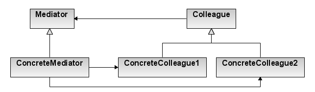

# 미디에이터 ( Mediator )
## 미디에이터 란?
---
- 미디에이터 패턴 혹은 서비스 미디에이터 패턴이라 불림
- 송신자와 수신자의 연결관계를 느슨하게 하기 위한 패턴, 즉 각각의 객체들(colleague)끼리 서로를 직접 참조하지 않고 중재자(mediator)를 통해 메세지를 주고 받을 수 있게 만드는 패턴

## UML
---


- Mediator : 
- ConcreteMediator : 
- Colleague : 
- ConcreteColleague : 

## 미디에이터 장/단점
### 장점
---
- 각각의 객체들은 서로에 대한 정보를 전혀 모르기 때문에 결합도가 낮아짐
- 전체적인 연결관계를 이해하기 쉬움

### 단점
---
- 특정 application 로직에 맞춰져있기 때문에 다른 application에 재사용하기 힘듬 ( Observer Pattern과 반대된다고 함 )
- 하나의 클래스 ( ConcreteMediator )가 여러 객체를 관리하는 형태를 가지기 때문에 신 ( God ) 클래스가 만들어지지 않도록 유의해야 함
- 신 ( God ) 클래스란 : 너무 많은 일을 하고 너무 많이 아는 클래스

## Example Code
---
- 주로 단체 채팅방을 만들 때 사용되는 있음

```cpp
class Colleague;

//단체톡방 인터페이스에 해당됨
class Mediator
{
public:
    virtual ~Mediator()
    {
    }

    void AddColleague(Colleague* colleague)
    {
        this->colleautes.push_back(colleague);
    }

    virtual void BroadCast(string message) = 0;
protected:
    std::vector<Colleague*> colleagues;
};

class ConcreteMediator : public Mediator
{
public:
    void BroadCast(string sender, string message)
    {
        printf("Sender : %s\n", sender);

        std::vector<Colleague*>::iterator iter;
        for(iter = collegues.begin(); iter != collegues.end(); iter++)
        {
            string receiverName = (*iter)->GetPlayerName();
            if(sender != recevierName)
            {
                (*iter)->ReceiveMessage(message);
            }
        }
    }
};

//단톡방에 포함되어 있는 사람의 인터페이스에 해당됨
class Colleague
{
public:
    virtual Colleague(string playerName)
    {
        this->playerName = playerName;
    }

    virtual ~Colleague()
    {
    }

    void SetMediator(Mediator* mediator)
    {
        this->mediator = mediator;
        this->mediator->AddColleague(this);
    }

    void SendMessage(string message)
    {
        mediator->BroadCast(playerName, message);
    }

    string GetPlayerName()
    {
        return playerName;
    }

    virtual ReceiveMessage(string message) = 0;

protected:
    Mediator *mediator;
    string playerName;
};

class ConcreteColleague : public Colleague
{
public:
    virtual ReceiveMessage(string message)
    {
        printf("receiver ( %s ) message : %s\n", playerName, message);
    }
};

Mediator* elegant_oop_handling = new ConcreteMediator();

Colleague* smjo = new ConcreteColleague("smjo");
Colleague* swhan = new ConcreteCollegue("swhan");
Colleague* jhpark = new ConcreteCollegue("jhpark");
Colleague* hsyu = new ConcreteCollegue("hsyu");

smjo->SetMediator(elegant_oop_handling);
swhan->SetMediator(elegant_oop_handling);
jhpark->SetMediator(elegant_oop_handling);
hsyu->SetMediator(elegant_oop_handling);

hsyu->SendMessage("hello everyone!");
//Sender : hsyu
//receiver ( smjo ) message : hello everyone!
//receiver ( smjo ) message : hello everyone!
//receiver ( smjo ) message : hello everyone!
```

## 참고자료
---
[boycoding](https://boycoding.tistory.com/120)
[medium](https://medium.com/@carlos.ariel.mamani/the-god-object-or-god-class-anti-pattern-bfb8c15eb513)
[a-researcher](https://a-researcher.tistory.com/29)
