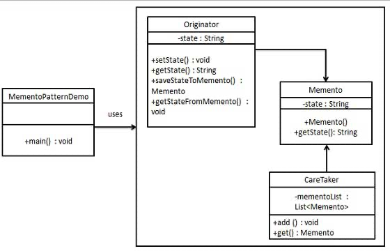

# 메멘토 패턴(`Memento Pattern`)

## 메멘토 패턴이란?

객체를 이전 상태로 되돌릴 수 있는 기능을 제공하는 디자인 패턴.

시스템의 핵심적인 기능을 담당하는 객체의 중요한 상태 저장.
핵심적인 객체의 캡슐화 유지.

> 객체의 상태 정보를 저장하고 사용자의 필요에 의하여 원하는 시점의 데이터를 복원할 수 있는 패턴.

---

## UML



- ### `Originator`

  - 현재 `state`를 가지고, `Memento` 객체와 `Memento` 객체 상태를 얻게 함
  - `state`를 복원하기 위해 `Memento`를 사용

- ### `Memento`

  - `state`를 가지고 있는 인스턴스
  - `Originator`의 `state`에 대한 스냅샷 역할을 하는 객체
  - `Originator` 이외 객체에 접근으로부터 보호
  - `Memento`를 `immutable`하게 만들고 생성자를 통해 데이터를 한 번만 전달

- ### `CareTaker`

  - `Memento`를 순서대로 저장
  - `Originator`의 동작 추적
  - `Memento`의 내용을 조작하거나 검토하지 않음

---

## 메멘토 패턴의 장단점

### 장점

- 캡슐화를 위반하지 않고 객체의 `state` 스냅샷을 생성할 수 있음.
- `CareTaker`가 `Originator`의 `state` 기록을 유지하므로 `Originator`의 코드가 단순화
- 어떤 목적으로 데이터를 삭제해버린 경우에도 간단히 복원 가능.
- 데이터가 바뀌더라도 원본 객체에는 영향이 없음.

### 단점

- 클라이언트가 `Memento` 객체를 너무 많이 생성하면 메모리와 비용이 많이 사용됨.
- `CareTaker`는 오래된 `Memento` 객체를 삭제할 수 있도록 `Originator`의 생명 주기를 추적해야 함. 즉, 자원을 소비해야 함
- 몇몇 언어에서는 `Originator`만 `Memento` 객체에 접근할 수 있도록 만드는 것이 어려울 수 있음.

## 메멘토 패턴 주 사용처

- 어떤 객체의 상태에 대한 스냅샷을 저장한 후 나중에 이 상태로 복구해야 할 때(내부 상태 기록, 복구하거나 실행 취소 기능 구현)
- 상태를 얻는데 필요한 직접적인 인터페이스를 두면 그 객체의 구현 세부사항이 드러날 수밖에 없고 이것으로 객체의 캡슐화가 깨질 때(내부 정보를 노출하지 않고 관리)
- 주로 `Command` 패턴과 같이 쓰임

## Example Code

- 간단한 구현 예제

```ts
class Memento {
  private state: string;
  constructor(state: string) {
    this.state = state;
  }

  public getState(): string {
    return state;
  }
}

class Originator {
  private state: string;
  public setState(state: string): void {
    this.state = state;
  }
  public getState(): string {
    return state;
  }
  public saveStateToMemento(): Memento {
    return new Memento(state);
  }
  public getStateFromMemento(memento: Memento) {
    this.state = memento.getState();
  }
}

class CareTaker {
  private mementoList: Memento[] = [];

  public add(memento: Memento): void {
    this.mementoList.push(memento);
  }

  public get(): Memento {
    return this.mementoList.pop();
  }
}

const careTaker: CareTaker = new CareTaker();
const originator: Originator = new Originator();

originator.setState("01 상태");
careTaker.add(originator.saveStateToMemento());

originator.setState("02 상태");
careTaker.add(originator.saveStateToMemento());

originator.setState("03 상태");
careTaker.add(originator.saveStateToMemento());

originator.getStateFromMemento(ct.get());
originator.getStateFromMemento(ct.get());
originator.getStateFromMemento(ct.get());
```

- 에디터 예제

```ts
class Snapshot {
  private editor: Editor;
  private state: string;

  constructor(editor: Editor, state: string) {
    this.editor = editor;
    this.state = state;
  }

  public restore(): void {
    editor.setState(state);
  }
}

class Editor {
  private state: string;
  public setState(state: string): void {
    this.state = state;
  }
  public getState(): string {
    return state;
  }
  public createSnapshot(): Snapshot {
    return new Snapshot(this, this.state);
  }
}

class Command {
  private backup: Snapshot[];

  constructor() {
    this.backup = [];
  }

  makeBackup(editor: Editor): void {
    const snapshot: Snapshot = editor.createSnapshot();
    this.backup.push(snapshot);
  }

  undo(): boolean {
    if (this.backup.length === 0) {
      console.log("There is no snapshot!");
      return false;
    } else {
      const snapshot = backup.pop();
      snapshot.restore();
      return true;
    }
  }
}

const command: Command = new Command();

const editor: Editor = new Editor();
editor.setState("abc");

command.makeBackup(editor);

editor.setState("abcde");
editor.setState("abcdefg");

command.makeBackup(editor);

editor.setState("ab");
command.makeBackup(editor);

editor.setState("");

while (command.undo()) {
  console.log(editor.getState());
}
```

---

## 참고 자료

- [위키 백과](https://ko.wikipedia.org/wiki/%EB%A9%94%EB%A9%98%ED%86%A0_%ED%8C%A8%ED%84%B4)
- [Refactoring-guru](https://refactoring.guru/design-patterns/memento)
- [DogHujup Blog](https://ocwokocw.tistory.com/112)
- [Beom Dev Log](https://beomseok95.tistory.com/283)
- [Dev_Pingu Blog](https://icksw.tistory.com/255)
- [Cham.log](https://velog.io/@cham/Design-Pattern-%EB%A9%94%EB%A9%98%ED%86%A0-%ED%8C%A8%ED%84%B4-Memento-Pattern)
- [Chaelin's Blog](https://chaelin1211.github.io/study/2021/05/07/Memento.html)
- [맛있는 프로그래머의 일상 Blog](https://lktprogrammer.tistory.com/65)
- [Sticky Blog](https://sticky32.tistory.com/entry/%EB%94%94%EC%9E%90%EC%9D%B8%ED%8C%A8%ED%84%B4-%EB%A9%94%EB%A9%98%ED%86%A0-%ED%8C%A8%ED%84%B4Memento-Pattern)
- [혼밥맨 Blog](https://gogetem.tistory.com/292)
