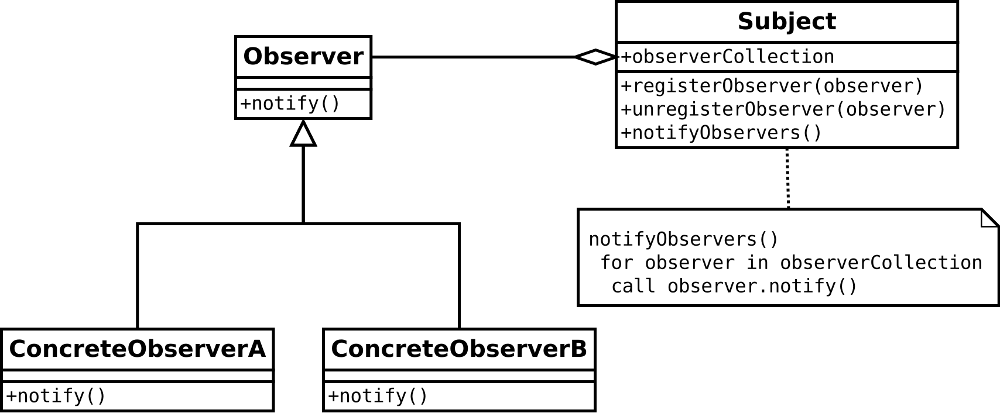

# Observer Pattern

## 옵저버 패턴이란?
- 객체의 상태 변화를 관찰하는 관찰자들, 즉 옵저버들의 목록을 객체에 등록해 상태 변화가 있을 때마다 각 옵저버에게 통지하도록 하는 디자인 패턴
- 주체 객체(Subject)와 상태의 변경을 구독 하는 관찰 객체(Observer)가 존재하며 1:N이 될 수 있음
- 일반적으로 등록(subscribe), 제거(unsubscribe) 메서드를 통해 이벤트 발생에 따라 callback을 실행시킬지 결정한다.

## UML


## 옵저버 패턴의 장단점

### 장점
- 실시간으로 한 객체의 변경사항을 다른 객체에 전파할 수 있다.
- 객체간 느슨한 결합으로 유연한 시스템과 객체간 의존성을 제거할 수 있다.

### 단점
- 너무 자주, 빈번하게 사용하면 상태관리가 힘들어지고 데이터 플로우를 파악하기 힘들어질 수 있다.
- 각각의 옵저버에서 자신이 호출되는 시점 등을 알 수 없다.
- unsubscribe를 하지 않으면 불필요한 연산이 생겨날 수 있다.
- 메시지가 연쇄적으로 발생해 의도치 않은 재귀현상이 일어날 수 있다.


## Example code

```js
class Subject {
  constructor(name) {
    this.name = name;
    this.observers = [];
  }

  subscribe(observer) {
    this.observers.push(observer);
  }

  unsubscribe(observer) {
    this.observers = this.observers.filter(myObserver => myObserver.name !== observer.name);
  }

  notify(changeOfState) {
    this.observers.forEach((observer) => observer.notify(changeOfState));
  }
}

class Observer {
  constructor(name) {
    this.name = name;
  }
  
  get name() {
    return this.name
  }
  
  notify(state) {
    console.log(`${this.name} is received ${state}`);
  }
}


const subject = new Subject('subject');

const observer1 = new Observer('first');
const observer2 = new Observer('second');

subject.subscribe(observer1);
subject.subscribe(observer2);

subject.notify('notify'); // first is received notify, second is received notify

subject.unsubscribe(observer2);

```


### 참조 link
- [위키백과](https://ko.wikipedia.org/wiki/%EC%98%B5%EC%84%9C%EB%B2%84_%ED%8C%A8%ED%84%B4)
- [리팩토링 구루](https://refactoring.guru/design-patterns/observer)