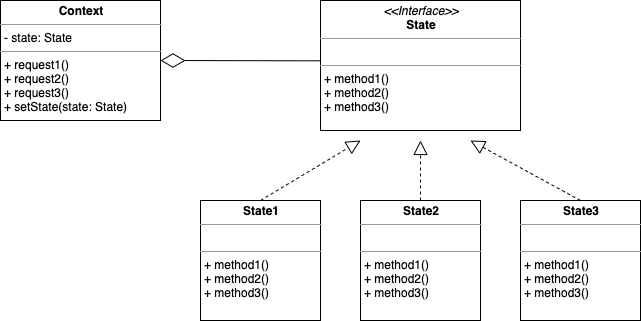

# 스테이트 패턴(`State Pattern`)

## 스테이트 패턴이란?

객체지향 방식으로 유한 상태 기계를 구현하는 디자인 패턴.

객체가 특정 상태에 따라 행위를 달리하는 상황에서, 자신이 직접 상태를 체크하여 상태에 따라 행위를 호출하지 않고, 상태를 객체화 하여 상태가 행동을 할 수 있도록 위임하는 패턴.

> 객체의 특정 상태를 클래스로 선언하고, 클래스에서는 해당 상태에서 할 수 있는 행위들을 메서드로 정의한 후, 각 상태 클래스들을 인터페이스로 캡슐화 하여 클라이언트에서 인터페이스를 호출하는 방식.

> 상태란, 객체가 가질 수 있는 어떤 조건이나 상황.

### 유한 상태 기계(`Finite State Machine`, `FSM`)

유한 오토마톤(`Finite Automaton`, `FA`) 또는 유한 오토마타(`Finite Automata`, 복수형)라고 불리며, 컴퓨터 프로그램과 전자 논리 회로를 설계하는 데에 쓰이는 수학적 모델.

유한한 개수의 상태를 가질 수 있는 추상 기계를 칭함.  
한 번에 하나의 상태 만을 가지게 되며, 현재 상태란 임의의 주어진 시간의 상태.  
이러한 기계는 어떠한 사건(Event)에 의해 한 상태에서 다른 상태로 변화할 수 있으며, 이를 전이(Transition)이라 함.


> 상태와 행동들을 노드로 연결시켜 도식화한 것을 말함.

> 순서도

### 스트래티지 패턴(`Strategy Pattern`, 전략 패턴)과의 비교

#### 공통점

- 인터페이스를 사용하여 구현 클래스를 캡슐화
- `Context` 클래스는 어떤 하위 클래스를 할당 받는지 알지 못 한 상태로 단순히 추상 메서드만 실행

> 두 패턴 모두 `Context` 클래스는 영향을 받지 않고 유연하게 변화에 대처

#### 차이점

- 스트래티지 패턴

  - `Context` 객체에게 다른 특정 객체를 지정해주고 실행
  - `Context` 객체 내에 참조 멤버 변수를 사용하여 하위 클래스에 객체의 참조를 전달하면, `Context` 객체의 코드 변경 없이도 `Context`의 행동을 변경할 수 있음
  - 즉, 다형성과 추상 메서드 호출을 이용하여 `Context` 클래스의 코드를 간략화
  - 상속을 줄임

  > 따라서, 프로그램 실행 시 `Context` 객체가 실행할 객체를 외부(클라이언트 객체)에서 유연하게 지정할 수 있는 장점

- 스테이트 패턴

  - 외부(클라이언트 객체)의 개입 없이 상태 객체 내부에서 현재 상태에 따라 `Context` 객체의 멤버인 상태 객체를 변경하여 사용
  - 분기문을 줄임

  > 외부에서 단순히 특정 메서드(행동)을 수행할 때마다 상태 구현 클래스 안에서 자동으로 상태가 변경

> 핵심은 로직을 수행하면서 행동 또는 상태의 변화가 외부의 개입이 필요한지, 특정 인터페이스의 구현 클래스에서 담당하는지(알아야 하는지)

---

## UML



- ### `State`

  - 시스템의 모든 상태에 공통의 인터페이스 제공
  - 이 인터페이스를 실체화한 어떤 상태 클래스도 기존 상태 클래스를 대신해 교체해서 사용 가능

- ### `State1`, `State2`, `State3`(`Concrete State`)

  - `Context` 객체가 요청한 작업을 자신의 방식으로 실제 실행
  - 대부분의 경우 다음 상태를 결정해 상태 변경을 `Context`에 요청하는 역할도 수행

- ### `Context`

  - `State`를 이용하는 역할을 수행
  - 현재 시스템의 상태를 나타내는 상태 변수(`state`)와 실제 시스템의 상태를 구성하는 여러 가지 변수 포함
  - 각 상태 클래스에서 상태 변경을 요청해 상태를 바꿀 수 있도록 하는 메서드(`setState`)가 제공
  - `Context` 요소를 구현한 클래스의 `request` 메서드는 실제 행위를 실행하는 대신 해당 상태 객체에 행위 실행을 위임

---

## 스테이트 패턴의 장단점

### 장점

- 하나에 객체에 대한 여러 동작을 구현해야할 때 상태 객체만 수정하므로 동작의 추가, 삭제 및 수정이 간단
- `State` 메커니즘은 상태에 대한 모든 행동 양식이 한 곳에 있기 때문에 유지보수에 용이
- 메서드 내의 긴 분기문을 제거 가능
- 코드가 간결해지고 가독성이 올라감
- 클라이언트는 `State` 객체에 대해 자세히 몰라도 됨
- 각 `State`를 변경하는 것에 대해서는 닫혀있으면서 `Context` 자체는 새로운 상태 클래스를 추가하는 확장에 대해서는 열림(`OCP`)

> 단일 책임 원칙, 개방/폐쇄 원칙

### 단점

- 클래스 갯수가 많아져서 오히려 유지보수 곤란한 상황 발생 가능성
- 상태에 따라 변하는 메서드의 수가 적다면 오히려 불필요한 복잡성 유발

---

## 스테이트 패턴 주 사용처

- `if ... else`, `switch` 문으로는 상태 테이블을 변화시키거나 새로운 상태를 추가하기 어렵게 되므로, 이러한 분기문을 제거할 때
- 조건문 반복 코드가 여기저기서 발견될 때
- 유저가 게시글에 어떠한 행동을 취할 때(게시글의 상태, 유저의 상태에 따라 다른 행동)
- `TCP connection`
- 스마트폰이나 노트북의 버튼/스위치는 현재 상태에 따라 다르게 실행
- 객체의 현재 상태에 따라 다르게 동작하는 객체가 있고 상태의 수가 많으며 상태 별로 코드(분기)가 자주 변경되는 경우
- 클래스 필드의 값에 따라 분기가 발생하는 경우

---

## Example Code

- 유튜브 구독 상태 구현 예제

```ts
class YoutubeApp {
  constructor(private state: YoutubeState) {}
  subscribe(state: YoutubeState) {
    console.log(state.name, "구독 시작");
    this.state = state;
  }
  unsubscribe() {
    this.state = new NoneSubscribeState();
  }
  clickHomeButton() {
    this.state.playBackground();
  }
  clickAppIcon() {
    this.state.playForeground();
  }
  clickDownload() {
    this.state.downloadVideo();
  }
}

interface YoutubeState {
  name: string;
  playBackground: () => void;
  playForeground: () => void;
  downloadVideo: () => void;
}

class PremiumSubscribeState implements YoutubeState {
  name: "프리미엄";
  playBackground() {
    console.log("백그라운드 재생");
  }
  playForeground() {
    console.log("영상 재생");
  }
  downloadVideo() {
    console.log("720p 화질로 다운로드");
  }
}

class NoneSubscribeState implements YoutubeState {
  name: "일반";
  playBackground() {
    console.log("재생 불가");
  }
  playForeground() {
    console.log("영상 재생");
  }
  downloadVideo() {
    console.log("다운로드 불가");
  }
}

class PrestigeSubscribeState implements YoutubeState {
  name: "프레스티지";
  playBackground() {
    console.log("백그라운드 재생");
  }
  playForeground() {
    console.log("영상 재생");
  }
  downloadVideo() {
    console.log("1080p 화질로 다운로드");
  }
}

const youtubeApp = new YoutubeApp(new NoneSubscribeState());
youtubeApp.clickAppIcon();
youtubeApp.clickHomeButton();
youtubeApp.clickDownload();

youtubeApp.subscribe(new PremiumSubscribeState());
youtubeApp.clickAppIcon();
youtubeApp.clickHomeButton();
youtubeApp.clickDownload();

youtubeApp.subscribe(new PrestigeSubscribeState());
youtubeApp.clickAppIcon();
youtubeApp.clickHomeButton();
youtubeApp.clickDownload();

youtubeApp.unsubscribe();
youtubeApp.clickAppIcon();
youtubeApp.clickHomeButton();
youtubeApp.clickDownload();
```

---

## 참고 자료

- [위키 백과 - State 패턴](https://ko.wikipedia.org/wiki/%EC%83%81%ED%83%9C_%ED%8C%A8%ED%84%B4)
- [위키 백과 - 유한 상태 기계](https://ko.wikipedia.org/wiki/%EC%9C%A0%ED%95%9C_%EC%83%81%ED%83%9C_%EA%B8%B0%EA%B3%84)
- [Refactoring-guru](https://refactoring.guru/design-patterns/state)
- [다루 Blog - State 패턴과 유한 상태 기계의 관계](https://daru-daru.tistory.com/70)
- [victolee Blog](https://victorydntmd.tistory.com/294)
- [TheUglyDucking Blog](https://velog.io/@y_dragonrise/%EB%94%94%EC%9E%90%EC%9D%B8-%ED%8C%A8%ED%84%B4-%EC%83%81%ED%83%9C-%ED%8C%A8%ED%84%B4State-Pattern)
- [느리더라도 꾸준하게 Blog - 스테이트 패턴과 스트래티지 패턴의 비교](https://steady-coding.tistory.com/387)
- [Cory Blog](https://kscory.com/dev/design-pattern/state)
- [언제나 신입 Blog](https://always-intern.tistory.com/9)
- [GENESIS8 Blog](https://genesis8.tistory.com/139)
- [Dev_Pingu Blog](https://icksw.tistory.com/258)
