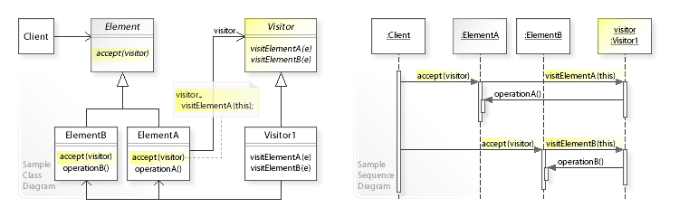

# 방문자 패턴(`Visitor Pattern`)

## 방문자 패턴이란?
- 실제 로직을 가지고 있는 객체(Visitor)가 로직을 적용할 객체(Element)를 방문하면서 실행하는 패턴
- 로직과 구조를 분리하여 구조를 수정하지 않고도 새로운 동작을 기존 객체에 추가할 수 있도록 함
- 방문 공간이 방문자를 맞이할 때, 이후에 대한 행동을 방문자에게 위임하는 패턴

## UML


## 방문자 패턴의 장단점

### 장점
- 작업 대상(방문 공간)과 작업 항목(방문 공간을 가지고 하는 일)을 분리시켜 코드의 응집도를 높이고자 할 때 사용한다.
- 작업 대상의 입장에서는 인터페이스를 통일시켜, 동일한 인터페이스를 제공한다

### 단점
- 새로운 작업 대상(방문 공간)이 추가될 때마다 작업 주체(방문자)도 이에 대한 로직을 추가해야 한다.
- 두 객체 (방문자와 방문 공간)의 결합도가 높아진다.

## Example Code

```ts
// Visitor
interface Benefit{
  getVipBenefit(member: VipMember): void;
  getGoldBenefit(member: GoldMember): void;
}

class DiscountBenefit implements Benefit{
  
  getVipBenefit(member: VipMember): void {
    console.log(`Vip ${member.name} get vip discount`);
  }

  getGoldBenefit(member: GoldMember): void {
    console.log(`Gold ${member.name} get gold discount`);
  }
}

class PointerBenefit implements Benefit{
  
  getVipBenefit(member: VipMember): void {
    console.log(`Vip ${member.name} get vip pointer`);
  }

  getGoldBenefit(member: GoldMember): void {
    console.log(`Vip ${member.name} get vip pointer`);
  }
}

// Element
interface Member{
  getBenefit(benefit: Benefit): void;
}

class VipMember implements Member {

  constructor(
    private readonly _name: string
  ) {}

  get name(){
    return this._name;
  }

  getBenefit(benefit: Benefit): void {
    benefit.getVipBenefit(this)
  }
}

class GoldMember implements Member {

  constructor(
    private readonly _name: string
  ) {}

  get name(){
    return this._name;
  }

  getBenefit(benefit: Benefit): void {
    benefit.getGoldBenefit(this)
  }
}

const goldMember = new GoldMember('gold user');
const vipMember = new VipMember('vip user');

const pointBenefit = new PointerBenefit();
goldMember.getBenefit(pointBenefit);
vipMember.getBenefit(pointBenefit);

const discountBenefit = new DiscountBenefit();
goldMember.getBenefit(discountBenefit);
vipMember.getBenefit(discountBenefit);
```

## 참고 자료

- [위키 백과](https://ko.wikipedia.org/wiki/%EB%B9%84%EC%A7%80%ED%84%B0_%ED%8C%A8%ED%84%B4)
- [refactoring guru](https://refactoring.guru/design-patterns/behavioral-patterns)
- [방문자 패턴 블로그](https://thecodinglog.github.io/design/2019/10/29/visitor-pattern.html)
