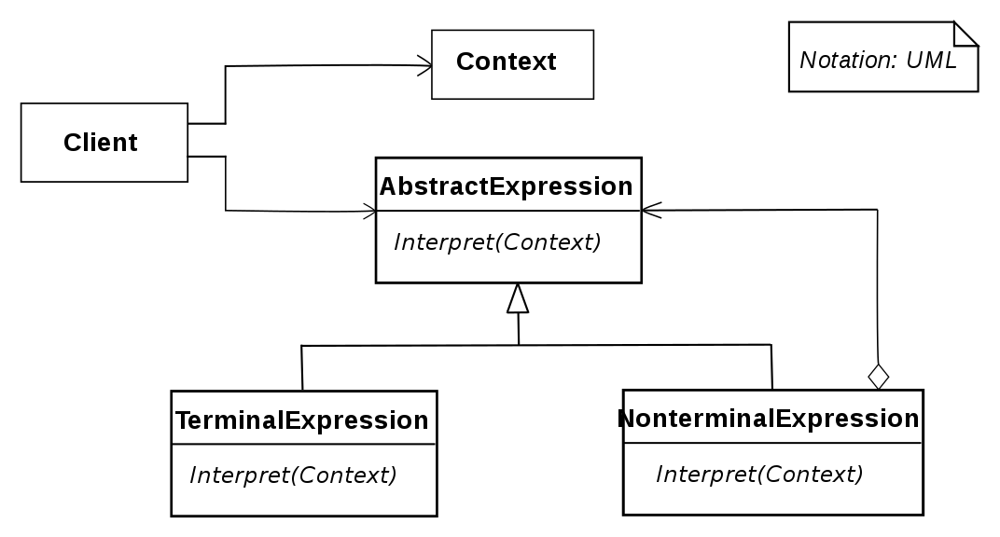

# 인터프리터 패턴(Interpreter Pattern)

## 인터프리터 패턴이란?

- 인터프리터 패턴은 언어의 문법을 기술하는 규칙들에 대한 형식 문법을 정의하고 각 규칙들을 클래스를 통해 구현하는 패턴이다.

## UML



- AbstractExpression(RegularExpression): Abstract Syntax Tree의 모든 노드에서 사용할 Interpret 작업을 정의한다.
- TerminalExpression(LiteralExpression): 문장에서의 최소 단위 즉, 터미널 기호와 관련된 작업을 구현한다.
- NonterminalExpression: 터미널 기호가 아닌 기호를 해석하는 연산을 구현한다.
- Context: 인터프리터가 해석할 문장이다.
- Client: 문법이 정의하는 언어의 특정 문장을 나타내는 Abstract Syntax Tree를 정의하며 인터프리터 연산을 호출한다.

## 장/단점

### 장점

- 각 문법 규칙을 클래스로 표현하기 때문에 언어를 쉽게 구현할 수 있다
- 문법이 클래스에 의해 표현되기 때문에 언어를 쉽게 변경하거나 확장할 수 있다

### 단점

- 문법 규칙의 개수가 많아지면 코드가 복잡해진다.

## Example Code

텍스트를 기반으로 주문을 분석하는 커피 머신 예제이다.

```js
// Context
class Context {
  constructor(input) {
    this.input = input.toLowerCase();
    this.output = {
      startCommand: false,
      endCommand: false,
      espresso: false,
      cappuccino: false,
      size: 'small',
    };
  }

  startsWith(str) {
    return this.input.includes(str);
  }
}

// AbstractExpression(RegularExpression)
class Expression {
  constructor(name, command) {
    this.name = name;
    this.command = command;
  }

  interpret(context) {
    if (context.input.length == 0) {
      return;
    } else if (context.startsWith(this.name)) {
      context.output = {
        ...context.output,
        [this.command]: ['small', 'medium', 'large'].includes(this.name)
          ? this.name
          : true,
      };
      context.input = context.input
        .split(' ')
        .filter((item) => item !== this.name)
        .join(' ');
    }
  }
}

// Client
function run(sentence) {
  const context = new Context(sentence);
  const tree = [];

  tree.push(new Expression('make', 'startCommand'));
  tree.push(new Expression('hi', 'startCommand'));
  tree.push(new Expression('hey', 'startCommand'));

  tree.push(new Expression('thanks', 'endCommand'));
  tree.push(new Expression('hurry up', 'endCommand'));

  tree.push(new Expression('espresso', 'espresso'));
  tree.push(new Expression('cappuccino', 'cappuccino'));

  tree.push(new Expression('small', 'size'));
  tree.push(new Expression('medium', 'size'));
  tree.push(new Expression('large', 'size'));
  console.log(tree);
  for (var i = 0, len = tree.length; i < len; i++) {
    tree[i].interpret(context);
  }

  console.log(`
I'm ${context.output.startCommand ? 'starting' : 'not starting'} prepare your
${context.output.size} ${context.output.espresso ? 'espresso' : 'cappuccino'}.
${
  context.output.endCommand ? 'Have a good day!' : 'What else I can help you?'
}`);
}
```

```js
run('Hi, please make me a medium cappuccino to go...'); // #1
run('Hello, espresso. Hurry up, Please!'); // #2

// #1
// "I'm starting prepare your
// medium cappuccino.
// What else I can help you?"

// #2
// I'm not starting prepare your
// small espresso.
// Have a good day!
```

## Reference

- [Easy patterns: Interpreter](https://itnext.io/easy-patterns-interpreter-58434c94304d)
- [인터프리터 패턴 (Interpreter Pattern)](https://johngrib.github.io/wiki/pattern/interpreter/)
- [Interpreter Pattern (인터프리터) - 디자인 패턴 공부 16](https://icksw.tistory.com/252)
