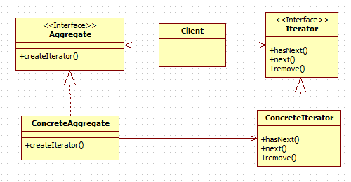

# 이터레이터 ( Iterator )
## 이터레이터 란?
---
- 접근 구조와 자료구조를 분리시켜서 객체화함
- 서로 다른 구조를 가지고 있는 저장 객체에 대해서 접근하기 위해서 interface 를 통일시키고 싶을 때 사용하는 패턴

 > 컬렉션 구현 방법을 노출시키지 않으면서도 그 집합체 안에 들어있는 모든 항목에 접근할 수 있음

## UML
---

- Iterator : 집합체의 요소들을 순서대로 검색하기 위한 인터페이스
- ConcreateIterator : Iterator 인터페이스를 구현함
- Aggregate : 여러 요소들로 이루어져 있는 집합체
- ConcreateAggregate : Aggregate 인터페이스를 구현하는 클래스

## 데코레이터 장/단점
### 장점
---
- 구현 방법을 노출 시키지 않으면서 접근이 가능
- 집합체 클래스의 응집도를 높여줌
- 모든 항목에 일일이 접근하는 작업을 컬렉션 객체가 아닌 이터레이터 객체에서 맡게되며, 이는 집합체의 집합체의 인터페이스 및 구현이 간단해짐

### 단점
---
- 단순히 순회를 구현하는 경우 클래스만 많아져 복잡도가 증가할 수 있음

## Example Code
---
- cpp의 std::vector::iterator 가 대표적인 iterator 패턴 예시임

```cpp
class Fruit
{
public:
    Fruit(std::string name)
    {
        m_name = name;
    }

    std::string getName()
    {
        return m_name;
    }

private:
    std::string m_name;
};

class Aggregate
{
    virtual std::shared_ptr<Iterator> createIterator() = 0;
};

class concreteAggregate :
    public Aggregate
{
public:
    void addFruit(std::string name)
    {
        std::shared_ptr<Fruit> fruit = std::make_shared<Fruit>(name);
        m_list.push_back(fruit);
    }

    std::shared_ptr<Iterator> createIterator() override
    {
        std::shared_ptr<Iterator> iterator = std::make_shared<IteratorObject>(m_list);
        return iterator;
    }

private:
    std::vector<std::shared_ptr<Fruit>> m_list;
};

class Iterator
{
public:
    virtual bool isDone() = 0;
    virtual std::shared_ptr<Fruit> next() = 0;
};

class IteratorObject :
    public Iterator
{
public:
    IteratorObject(std::vector<std::shared_ptr<Fruit>> fruits)
    {
        m_index = 0;
        for (const auto& fruit : fruits)
        {
            m_fruits.push_back(fruit);
        }
    }

    bool isDone() override
    {
        if (m_index < m_fruits.size())
        {
            return true;
        }
        else
        {
            return false;
        }
    }

    std::shared_ptr<Fruit> next() override
    {
        std::shared_ptr<Fruit> fruit = m_fruits[m_index];
        m_index++;

        return fruit;
    }

private:
    std::vector<std::shared_ptr<Fruit>> m_fruits;
    int m_index;
};

std::shared_ptr<concreteAggregate> menu = std::make_shared<concreteAggregate>();
menu->addFruit("Apple");
menu->addFruit("Orange");
menu->addFruit("Melon");
menu->addFruit("Banana");

std::shared_ptr<Iterator> iter = menu->createIterator();
while (iter->isDone())
{
    auto item = iter->next();
    std::cout << item->getName() << std::endl;
}
```

## 참고자료
---


