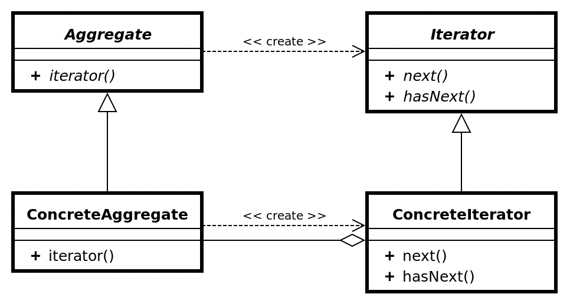

# 이터레이터 패턴 (Iterator)

## 이터레이터 패턴이란?

컬렉션의 구현 방법을 노출시키지 않고 컬렉션의 요소를 순회할 수 있는 행동 디자인 패턴이다. 반복자 패턴이라고 부르기도 한다.

이터레이터 패턴을 사용하면 개발자가 정의하고자 하는 순회 방식으로 컬렉션의 요소에 접근할 수 있다.

## UML

- Aggregate: 컬렉션 유형에 무관하게 컬렉션의 요소의 방법을 제공하는 반복자 객체를 생성하기 위한 인터페이스다.
- Iterator: 컬렉션의 요소에 접근하고 순회할 수 있는 반복자 인터페이스다.
- ConcreteAggregate | Iterator: Aggregate와 Iterator 인터페이스의 구현체다.

## 이터레이터 패턴 장단점

### 장점

- 컬렉션이 어떻게 구현되었는가에 의존할 필요 없이 Iterator의 메서드를 사용해 접근할 수 있다.

### 단점

- 컬렉션 요소의 순회를 구현하는 경우 클래스가 많아져 복잡해질 수 있다.

## 주사용처

- 컬렉션의 요소를 순회할 때 사용할 수 있다.

## Example Code
