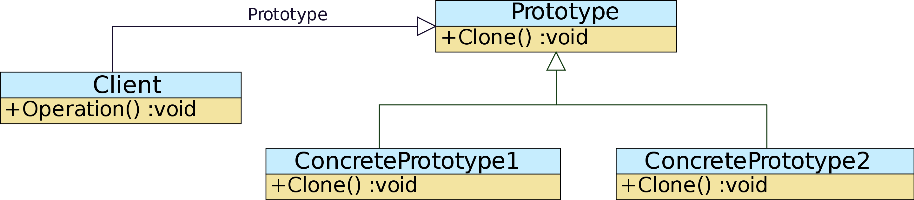

# Prototype Pattern


## 프로토타입 패턴이란?
- 객체를 생성하는 데 비용(시간과 자원)이 많이 들고, 비슷한 객체가 이미 있는 경우에 사용되는 생성 패턴 중 하나
- 코드를 클래스에 종속시키지 않고 기존 객체를 복사
- 기본 원형이 되는 인스턴스를 사용해서 생성할 객체의 종류를 명시하고 이렇게 만들어진 객체를 복사해서 새로운 객체를 생성

## UML


- Prototype: 복제하는 인터페이스 정의
- ConcretePrototype(n): 복제하는 연산 구현
- Client: 복제를 요청 및 새로운 객체를 생성

## Example code

```ts
interface ICloneable {
  clone(): void;
}

interface ICar extends ICloneable{
  ride(): void;
  stop(): void;
}

class Car implements ICar {
  constructor(args) {
    this.series = args.series;
    this.color = args.color;
    this.engine = args.engine;
  }
  set setColor(color){
    this.color = color;
  }
  set setOptions(options){
    this.options = options;
  }
  ride(){
    console.log('ride')
  }
  stop(){
    console.log('stop')
  }
  clone() {
    return Object.assign({}, this);
  }
}

const benz = new Car({series: 'S', color: 'grey', engine: 'gasoline'});

const myBenz = benz.clone();
myBenz.setOptions = ['선루프', '크루즈 컨트롤', '난방 시트'];

const yourBenz = benz.clone();
yourBenz.setColor = 'white'
yourBenz.setOptions = ['크루즈 컨트롤', '자율주행', '매직 바디 컨트롤'];
```


### 참조 link
[https://refactoring.guru/design-patterns/prototype](https://refactoring.guru/design-patterns/prototype)
[https://ko.wikipedia.org/wiki/%ED%94%84%EB%A1%9C%ED%86%A0%ED%83%80%EC%9E%85_%ED%8C%A8%ED%84%B4](https://ko.wikipedia.org/wiki/%ED%94%84%EB%A1%9C%ED%86%A0%ED%83%80%EC%9E%85_%ED%8C%A8%ED%84%B4)
