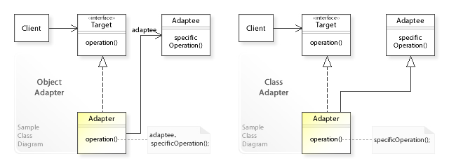

# 어댑터 패턴(Adapter Pattern)

## 어댑터 패턴이란?

어댑터 패턴은 클래스가 다른 클래스의 인터페이스를 사용하기 위해 기존 클래스를 수정하지 않고 어댑터 클래스를 통해 작동하게 하는 패턴이다. 래퍼(wrapper) 패턴이라고 부르기도 한다.

## UML



- Target: 클라이언트 인터페이스 정의
- Adapter: Adaptee 인터페이스를 target에 어댑트
- Adaptee: 어댑팅이 필요한 인터페이스 정의
- Client

## [패턴 장/단점]

### 장점

- 기존 인터페이스를 변경할 필요가 없이 어댑터 구현을 통해 다른 클래스를 사용할 수 있다.
- 새로운 코드의 기능을 일관되게 사용할 수 있다.

### 단점

- 상황에 따라 어댑터 구현이 복잡해져 클라이언트 인터페이스를 수정하는 것이 나은 케이스가 있을 수 있다.

## [패턴 주 사용처]

- 기존 코드의 변경 없이 다른 인터페이스를 사용해야할 때 사용한다.
- 써드 파티 라이브러리를 기존 코드와 분리해 사용하기 위해 어댑터를 중간 역할로 사용한다.

## [Example code]

```js
class Animal {
  constructor(species) {
    this.species = species;
  }

  walk() {
    return `${this.species} is walking...`;
  }
}

class Dog extends Animal {}

class Cat extends Animal {}

class FishAdapter extends Animal {
  constructor(fish) {
    super(fish);
    this.fish = fish;
  }

  walk() {
    return this.fish.swim();
  }
}

class Fish extends FishAdapter {
  swim() {
    return `${this.fish} is swimming...`;
  }
}

const dog = new Dog('dog');
const cat = new Cat('cat');

console.log(dog.walk()); // dog is walking...
console.log(cat.walk()); // cat is walking...

const fish = new Fish('fish');
const adaptedFish = new FishAdapter(fish);
console.log(adaptedFish.walk()); // fish is swimming...
```

---

### Reference

- [Adapter pattern](https://en.wikipedia.org/wiki/Adapter_pattern)
- [Adapter Pattern](oodesign.com/adapter-pattern.html)
- [디자인패턴, Adapter Pattern, 아답터 패턴](https://www.youtube.com/watch?v=IHU-wDglGM0&ab_channel=%EC%BD%94%EB%93%9C%EC%97%86%EB%8A%94%ED%94%84%EB%A1%9C%EA%B7%B8%EB%9E%98%EB%B0%8D)
