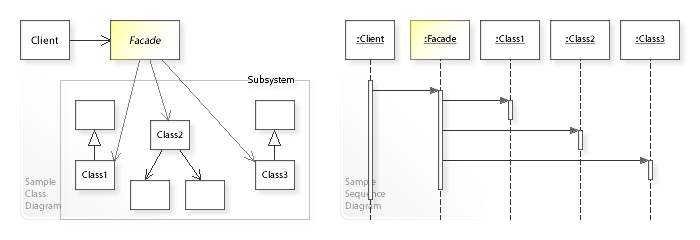

# Facade Pattern

퍼사드 패턴은 서브시스템을 더 쉽게 사용할 수 있는 high-level의 인터페이스를 정의하는 패턴이다.

## UML



## 장/단점

### 장점

- 단순한 인터페이스로 복잡한 서브시스템을 쉽게 사용할 수 있다.
- 복잡하게 작성된 API의 집합을 하나의 좋게 작성된 API로 감싸준다.

### 단점

- 서브시스템 코드를 호출하기 위해 인터페이스를 정의해야하므로 코드량이 많아 질 수 있다.

## [패턴 주 사용처]

- 여러 클래스나 라이브러리를 사용할 때 클래스나 라이브러리를 조합한 간단한 인터페이스를 만들어 사용할 수 있다.

## [Example code]

```js
// Sub System
class CPU {
  freeze() {
    console.log('CPU: freeze');
    return 'CPU: freeze';
  }
  jump() {
    console.log('CPU: jump');
    return 'CPU: jump';
  }
  execute() {
    console.log('CPU: execute');
    return 'CPU: execute';
  }
}

class Memory {
  load() {
    console.log('Memory: load');
    return 'Memory: load';
  }
}

class HDD {
  read() {
    console.log('Hard Drive: read');
    return 'Hard Drive: read';
  }
}

// Facade

class Computer {
  constructor() {
    this.cpu = new CPU();
    this.memory = new Memory();
    this.hdd = new HDD();
  }

  start() {
    this.cpu.freeze();
    this.memory.load();
    this.hdd.read();
    this.cpu.jump();
    this.cpu.execute();
  }
}

const computer = new Computer();
computer.start();

/*
  CPU: freeze
  Memory: load
  Hard Drive: read
  CPU: jump
  CPU: execute
*/
```

---

## 참고자료

- [퍼사드 패턴](https://ko.wikipedia.org/wiki/%ED%8D%BC%EC%82%AC%EB%93%9C_%ED%8C%A8%ED%84%B4)
