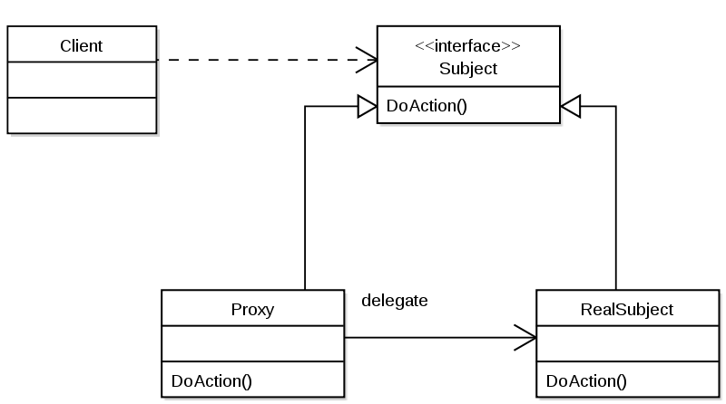

# 프록시 패턴(`Proxy Pattern`)

## 프록시 패턴이란?

프록시(`Proxy`): 대리자, 대변인이라는 뜻으로, 어떠한 것과도 인터페이스의 역할을 수행하여, 다른 무언가와 이어지는 클래스. 프록시에게 어떤 일을 대신 시키는 것.

인터페이스를 사용하고 실행시킬 클래스에 대한 객체가 들어갈 자리에 프록시 객체를 대신 투입해 클라이언트 쪽에서 실제 실행시킬 클래스에 대한 객체를 통해 메서드를 호출하고 반환 값을 받는지, 프록시 객체를 통해 메서드를 호출하고 반환 값을 받는지 전혀 모르게 처리하는 것.

> 어떤 객체에 대한 접근을 제어하는 용도로 대리인에 해당하는 객체를 제공하는 패턴.

> 객체의 접근을 제어, 흐름 제어.

---

## UML

- ### `Subject`

  - `Proxy` 와 `RealSubject`가 구현해야하는 인터페이스
  - 두 객체를 동일하게 다루기 위해 존재

- ### `Proxy`

  - `RealSubect`와 `Client` 요청 사이에 존재하는 객체
  - `Subject`를 구현함으로써 클라이언트는 `RealSubject` 사용하는 것과 별 차이가 없어야 함

- ### `RealSubject`
  - 실질적으로 요청에 대해 주된 기능을 수행하는 객체
  - `Proxy` 객체는 내부적으로 이 객체를 로직에 맞게 사용 (위임)

클라이언트가 어떤 일에 대한 요청(`DoAction`)을 하면, 프록시가 대신 `RealSubject`의 `DoAction` 메서드를 호출하고 그 반환 값을 클라이언트에 전달.

- 프록시는 실제 서비스와 같은 이름의 메서드를 인터페이스를 사용하여 구현.
- 프록시는 실제 서비스에 대한 참조 변수를 가짐.(합성)
- 프록시는 실제 서비스의 같은 이름을 가진 메서드를 호출하고 그 값을 클라이언트에게 돌려줌.
- 프록시는 실제 서비스의 메서드 호출 전 후에도 별도의 로직을 수행할 수 있음.

> `Client` -> `Proxy` -> `RealSubject` 형태로 구성된 구조.

---

## 프록시 패턴의 장단점

### 장점

- 사이즈가 큰 객체(Ex. 이미지)가 로딩되기 전에도 프록시를 통해 참조.
- 실제 객체의 `public`, `protected` 메소드들을 숨기고 인터페이스를 통해 노출.
- 로컬에 있지 않고 떨어져 있는 객체를 사용 가능.
- 기본 객체에 대한 수정 없이, 클라이언트에서의 사용과 기본 객체 사이에 일련의 로직을 프록시 객체를 통해 넣음.
- 프록시는 기본 객체와 요청 사이에 있기 때문에, 일종의 방패(보안)의 역할.
- 원래 객체의 접근에 대해서 사전처리 가능.

### 단점

- 프록시 객체가 중간에 껴있어 간혹 응답 속도 저하. (캐싱이 안되어있는 초기 사용의 경우)
- 객체를 생성할때 한 단계를 거치게 되므로, 빈번한 객체 생성이 필요한 경우 성능이 저하.
- 프록시 내부에서 객체 생성을 위해 스레드가 생성, 동기화가 구현되야 하는 경우 성능이 저하.
- 로직이 난해해져 가독성이 저하.

## 프록시 패턴의 주 사용처

- 기본 객체가 리소스 집약적인 경우. 자잘한 작업들은 프록시 객체가 처리하게 함.
- 기본 객체에 접근을 제어해야하는 경우. 프록시 객체가 권한에 따라 접근 로직을 다르게 처리하게 함.
- `React.js`의 이벤트 객체.
- `C++`의 `std::vector<bool>` 클래스도 내부적으로는 1비트 단위로 접근하기 위해 비트 연산을 동원하는데, 이 과정에서 프록시 클래스를 경유.
- `C++`의 표현식 템플릿(`expression template`) 이라는 고급 최적화 기법을 구현하는 방법.

- ### 가상 프록시

  꼭 필요로 하는 시점까지 객체의 생성을 연기하고, 해당 객체가 생성된 것처럼 동작하도록 만들고 싶을때 사용하는 패턴. 프록시 클래스에서 자잘한 작업들을 처리하고 리소스가 많이 요구되는 작업들이 필요할 때에만 주체 클래스를 사용하도록 구현.

  Ex) 해상도가 아주 높은 이미지를 처리해야 하는 경우 작업을 분산 하는 것.

- ### 원격 프록시

  원격 객체에 대한 접근을 제어 로컬 환경에 존재하며, 원격객체에 대한 대변자 역할을 하는 객체 서로 다른 주소 공간에 있는 객체에 대해 마치 같은 주소 공간에 있는 것처럼 동작하게 만드는 패턴.

  Ex) `Google Docs`. 브라우저는 필요한 자원을 로컬에 가지고 있고 또 다른 자원은 `Google` 서버에 있는 형태.

- ### 보호 프록시

  주체 클래스에 대한 접근을 제어하기 위한 경우에 객체에 대한 접근 권한을 제어하거나 객체마다 접근 권한을 달리하고 싶을때 사용하는 패턴.

  프록시 클래스에서 클라이언트가 주체 클래스에 대한 접근을 허용할지 말지 결정.

- 방화벽 프록시
- 스마트 레퍼런스 프록시
- 캐싱 프록시
- 동기화 프록시
- 복잡도 숨김 프록시
- 지연 복사 프록시

## Example Code

---

## 참고 자료

- [위키 백과](https://ko.wikipedia.org/wiki/%ED%94%84%EB%A1%9D%EC%8B%9C_%ED%8C%A8%ED%84%B4)
- [Limky 삽질 Blog](https://limkydev.tistory.com/79)
- [코딩 팩토리 Blog](https://coding-factory.tistory.com/711)
- [JDM Blog](https://jdm.kr/blog/235)
- [하나씩 점을 찍어 나가며 Blog](https://dailyheumsi.tistory.com/201)
- [JavaScript에서 프록시 패턴](https://velog.io/@lesh/Javascript%EC%97%90%EC%84%9C%EC%9D%98-Proxy-Pattern%EA%B3%BC-Proxy%EA%B0%9D%EC%B2%B4-3njz2d5vl1)
- [Lee's Grow up](https://lee1535.tistory.com/101)
