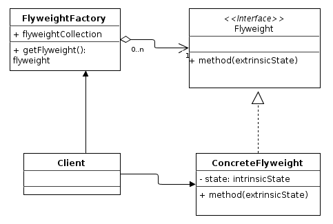

# 플라이웨이트 ( flyweight )
## 플라이웨이트 란?
- 어떤 클래스의 인스턴스 한 개만 가지고 여러 개의 "가상 인스턴스"를 제공하고 싶을 때 사용하는 패턴
- 즉 인스턴스를 가능한 대로 공유시켜 쓸데없이 new 연산자를 통한 메모리 낭비를 줄이는 방식

## UML


- Flyweight : 공유에 사용할 클래스들의 인터페이스(API) 선언
- ConcreteFlyweight : Flyweight의 내용을 정의, 실제 공유될 객체
- FlyweightFactory : 해당 공장을 사용해서 Flyweight의 인스턴스를 생성 또는 공유해주는 역할
- Client : 해당 패턴의 사용자

## 플라이웨이트 장/단점
### 장점
- 많은 객체를 만들 때 성능을 향상시킬 수 있음
- 많은 객체를 만들 때 메모리를 줄일 수 있음
- state pattern과 쉽게 결합될 수 있음

### 단점
- 특정 인스턴스의 공유 컴포넌트를 다르게 행동하게 하는 것이 불가능
- 공통된 자원이 있기 때문에 공통된 부분을 싱글톤처럼 사용
- 서로 다른 일부 객체는 다르게 사용해야 함


## Example Code
```cpp
class Shpae
{
public:
    virtual void draw() = 0;
}

class Circle : public Shape
{
private:
    string color;
    int x;
    int y;
    int radius;

public:
    Circle(string color)
        :color(color)
    {
    }

    void setColor(string color)
    {
        this.color = color;
    }

    void setX(int x)
    {
        this.x = x;
    }

    void setY(int y)
    {
        this.y = y;
    }

    void setRadius(int radius)
    {
        this.radius = radius;
    }

    void draw() override
    {
        std::cout << "Circle color : " << color.c_str() << ", x : " << x << ", y : " << y << ", radius : " << radius << std::endl;
    }
}

class ShapeFactory
{
private:
    static map<string, Shape> circleMap;

public:
    Shape getCircle(string color)
    {
        if ( circleMap.find(color) == circleMap.end())
        {
            circleMap[color] = new Circle(color);
        }
        else
        {
            std::cout << "reuese" << std::endl;
        }
        return circleMap[color];
    }
}

ShapeFactory* factory = new ShapeFactory();

Circle* circleRed = factory->getCircle("Red");
Circle* circleBlue = factory->getCircle("Blue");

circleRed.draw();
circleBlue.draw();

```

## 참고자료


